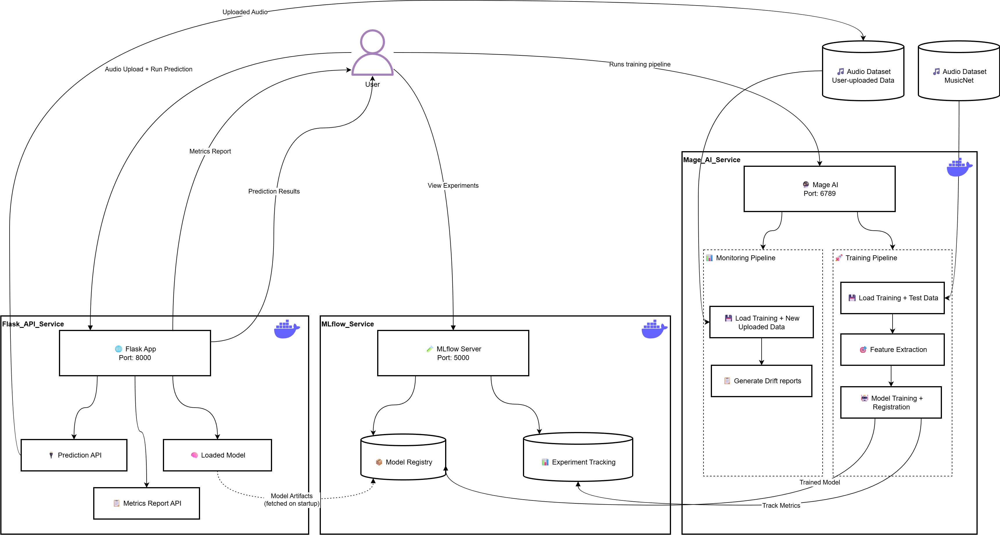

# Classical Composer Prediction

This project is done as submission to the [MLOpsZoomCamp 2025 cohort](https://github.com/DataTalksClub/mlops-zoomcamp/tree/main/cohorts/2025) capstone project.


## Problem Statement


Music is one of the greatest gifts of mankind - it allows people to celebrate their cultures, beliefs, and lives in a universal way. 

Classical music is one of the existing proofs, that music can stand the test of time and stay relevant decades after it was created. With a vast collection of musical pieces, automatic identification of classical composers can help ease the process of metadata generation, categorization, and archiving of digital data. In another use case, the classified/categorized data can be further use to group composers with similar styles, which can be useful for music recommendation systems.

In this project, the aim is to build a RandomForestClassifier as an initial model to predict classical music composers based on some snippet of classical piano audio data. The training and validation data are in .wav format, but the unseen data can either be in .wav or .mp3 format. The librosa library is used to extract audio features from these files.

The dataset used is from [MusicNet](https://zenodo.org/records/5120004), which is openly available.

## Setting up the Local Environment
Firstly, we need to ensure that Docker engine is running in the background. To do this, we can simply run Docker Desktop and ensure it is running. 

Next, for deployment, we will use Terraform so it needs to be installed.

After that, create a local virtual environment by running:
```
make setup     # --> Creates a fresh local virtual environment
```

Then download the necessary dataset to be able to run the training pipeline.
```
make download-data
```

For local testing, run the following commands to prepare the containers and run the services:
```
make test      # --> Runs all the local unit tests
make up        # --> Builds and runs all containers locally
make down      # --> Removes existing containers
```

## Overview of the Dataset
The MusicNet Dataset consists of already splitted `train` and `test` datasets. The data are .wav audio files of classical piano pieces by famous composers.
- `train` dataset: 320 .wav audio files
- `test` dataset: 10 .wav audio files

The `musicnet_metadata.csv` is also used to get the file identifiers and composer labels.

## Classification Model
To predict the composer, audio features are extracted from the audio files using the [librosa](https://librosa.org/doc/latest/index.html) library. Features include:
- MFCCs
- Spectral characteristics (centroid, rolloff, bandwidth)
- Harmonic-percussive separation
- Tempo and rhythm analysis
- Chroma features
- Tonnetz representations
- Energy dynamics
- Onset detection
- Spectral contrast. 

The training pipeline has configurable parameters for sample rate, duration, and feature dimensions, integrating MLflow for experiment tracking and returning structured DataFrames ready for machine learning workflows.

A RandomForestClassifier model is trained on the extracted features from the training data, and evaluated on the test dataset.

## Architecture


### Orchestration
In this project, Mage AI is used as the orchestrator tool. Two pipelines have been developed:
- Training pipeline -> runs on-demand with manual trigger. Tracks experiment with MLFlow.
- Monitoring pipeline -> Tracks Data Drift and Prediction Drift. Can be scheduled to run daily. Generates report with Evidently

### Deployment
There are 3 containerized services:
- MLFlow: Service for accessing MLFlow UI and serving artifacts (models)
- Mage AI: Orchestration service for training and monitoring
- API: Flask application for serving the inference model, which is fetched from MLFlow's Model Registry.

The container images are pushed to Google Artifact Registry. To build all containers and push to Google Artifact Registry + Google Cloud Run, run `make deploy`.

### Inference
(Currently only possible when running containers locally)

After running the containers locally with `make up`, you can access a very very simple web interface on `http://127.0.0.1:8000`. From this page, you can upload a .wav or .mp3 classical piano audio file and run the inference, to get the predicted composer.

## Remaining TODO
Due to time constraints, there are still a few issues which needs to be fixed for this project:
- After deploying, I realized that I still need to configure the service addresses so that the API service can fetch the model from MLFlow's Model Registry directly.
- Probably, it is better to have the pipelines outside of the generated project directory from Mage for better visibility and unit testing, and then import the pipeline into Mage AI.
- Also need to implement some integration tests apart from the unit tests.
- Need to setup databases to store experiments and user-generated data.

